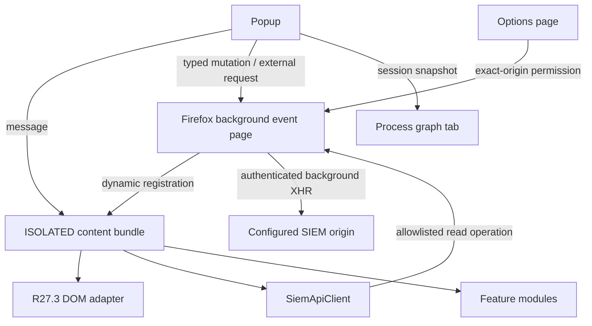

# Current architecture

## Baseline captured from 2.27.3

The original extension used one static content script bundle on every HTTP(S) page, a Chrome MV3 service worker, multiple broad MutationObservers and a MAIN-world `XMLHttpRequest.send` replacement. DOM selectors, API calls and feature state were global. Options, VirusTotal and LLM keys were stored together in sync storage and copied into `window.globalMonkeyOptions`.

Useful domain knowledge retained during migration:

- MP SIEM event, metadata, filter, Table List, account, app, rule, asset and EDR endpoint paths;
- event field names and R27.3 selectors/fallbacks;
- Sysmon 1, Windows 4688 and Linux `execve` process relationships;
- event export, share link, enrichment, custom filters and IOC description workflows.

## Firefox 3.2 layers

- `src/background`: registration lifecycle, allowlisted same-origin read proxy, specialized IOC/Table List mutations, graph session snapshots, secret-backed external adapters, tab opening.
- `src/content`: per-instance orchestration, live settings propagation and popup message API.
- `src/siem/api`: transport-independent client, timeout/cache and typed errors.
- `src/siem/dom`: R27.3 adapter with cached roots/field index and one debounced multi-root observer controller. Mutation batches incrementally invalidate only changed roots.
- `src/siem/features`: field actions, related events, IOC, Table Lists and EDR UI.
- `src/siem/process`: indexed bounded process graph, PID time-window protection, local filters and visualization model; `src/process-graph` renders an autonomous session snapshot with spatial hit testing.
- `src/shared`: settings/migration, secret separation, PDQL, URL, hash, time, stable error codes, structured logging and exact AI-payload preparation.
- `src/popup` / `src/options`: shared application operations rendered with DOM APIs.

## Security invariants

The built manifest has no `host_permissions` or `content_scripts`. Dynamic registration only follows a granted exact-origin permission and registers only an `ISOLATED` bundle. Internal SIEM API messages are accepted only from a configured SIEM tab, resolve back to that exact origin and pass a method/path allowlist. Generic reads cannot reach mutating Table List routes; those routes require specialized confirmed actions and a second metadata/token check. No key is returned by `settings:get`. External API calls are restricted to extension pages or explicit IOC field actions and require host plus Firefox data-collection permissions. AI sends only a body whose freshly recomputed SHA-256 matches the exact preview.
