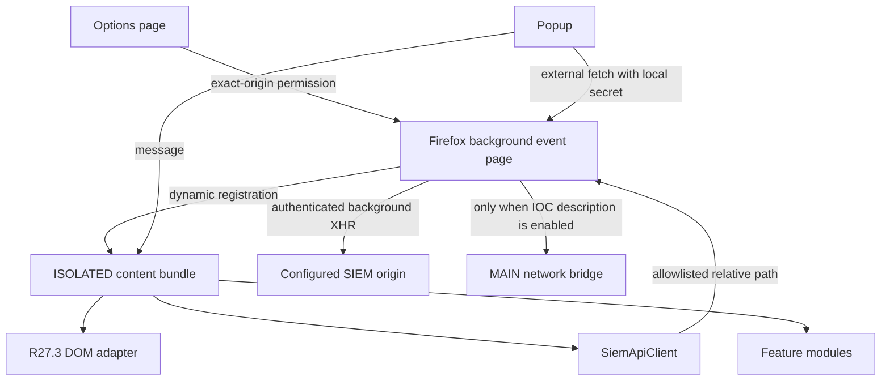

# Current architecture

## Baseline captured from 2.27.3

The original extension used one static content script bundle on every HTTP(S) page, a Chrome MV3 service worker, multiple broad MutationObservers and a MAIN-world `XMLHttpRequest.send` replacement. DOM selectors, API calls and feature state were global. Options, VirusTotal and LLM keys were stored together in sync storage and copied into `window.globalMonkeyOptions`.

Useful domain knowledge retained during migration:

- MP SIEM event, metadata, filter, Table List, account, app, rule, asset and EDR endpoint paths;
- event field names and R27.3 selectors/fallbacks;
- Sysmon 1, Windows 4688 and Linux `execve` process relationships;
- event export, share link, enrichment, custom filters and IOC description workflows.

## Firefox 3.0 layers

- `src/background`: registration lifecycle, allowlisted same-origin SIEM proxy, secret-backed external adapters, tab opening.
- `src/content`: per-instance orchestration and popup message API.
- `src/page-bridge`: idempotent XHR/fetch bridge with endpoint allowlist, TTL and unpatch.
- `src/siem/api`: transport-independent client, timeout/cache and typed errors.
- `src/siem/dom`: R27.3 adapter and one debounced observer controller.
- `src/siem/features`: field actions, related events, IOC, Table Lists and EDR UI.
- `src/siem/process`: bounded local process graph and visualization model; `src/process-graph` renders the interactive graph in an independent extension tab.
- `src/shared`: settings/migration, secret separation, PDQL, URL, hash, time and logging.
- `src/popup` / `src/options`: shared application operations rendered with DOM APIs.

## Security invariants

The built manifest has no `host_permissions` or `content_scripts`. Dynamic registration only follows a granted exact-origin permission. Internal SIEM API messages are accepted only from a configured SIEM tab, resolve back to that exact origin and pass a method/path allowlist. No key is returned by `settings:get`. External API calls are restricted to extension pages and require host plus Firefox data-collection permissions. MAIN bridge state contains only a one-use token/description/username for the selected table and expires after 30 seconds.
